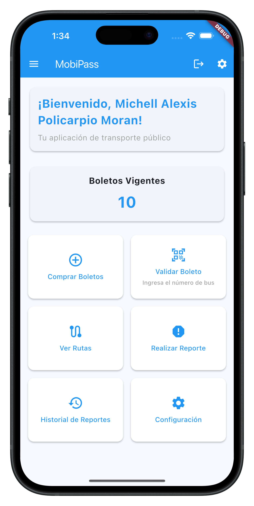
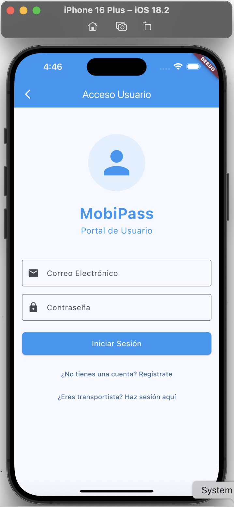
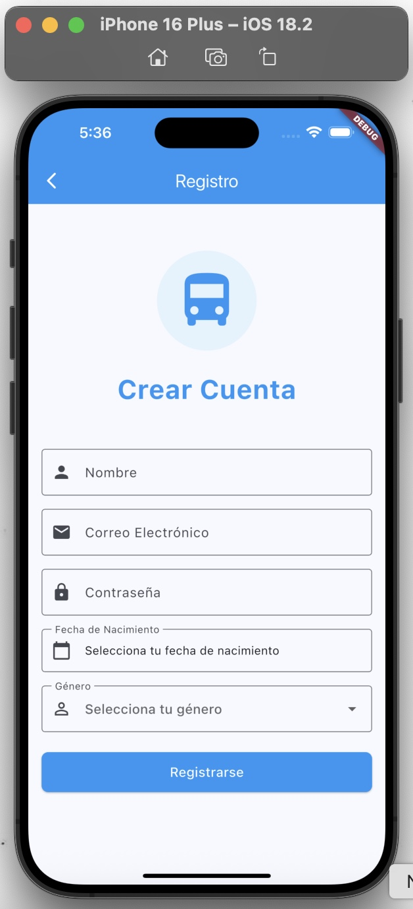
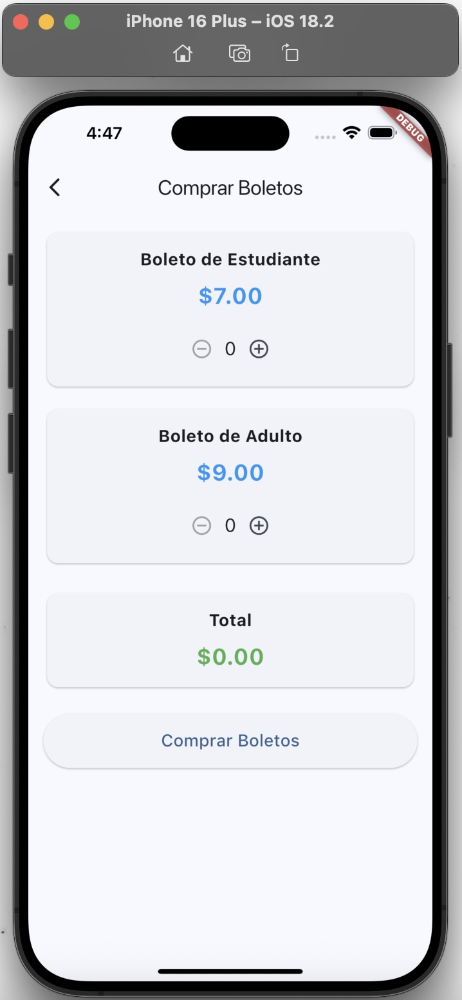
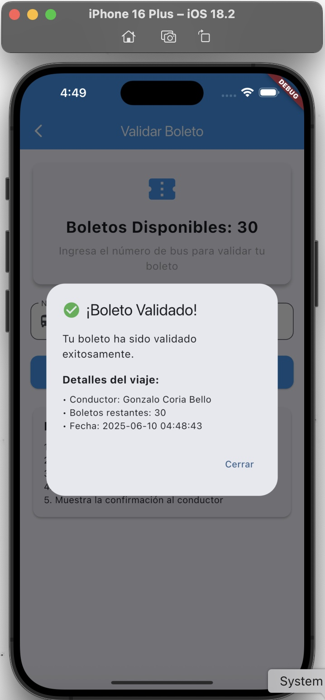
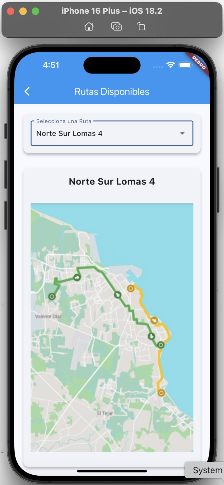
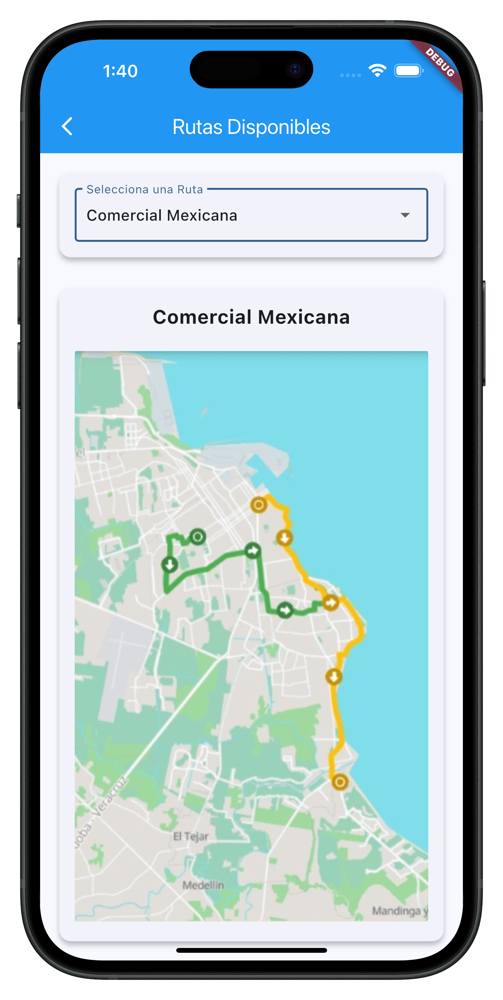
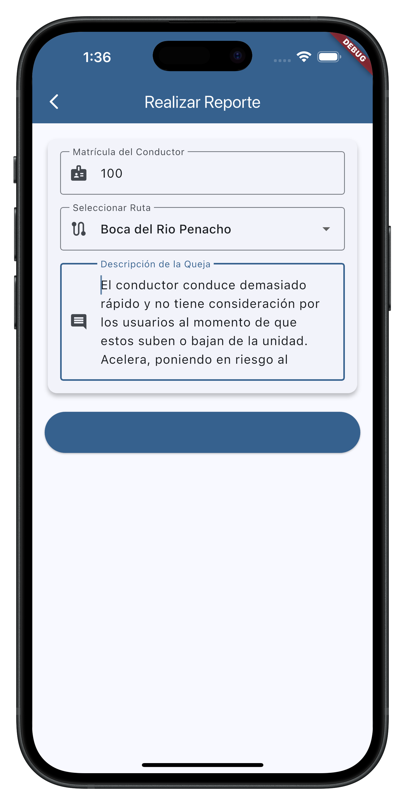
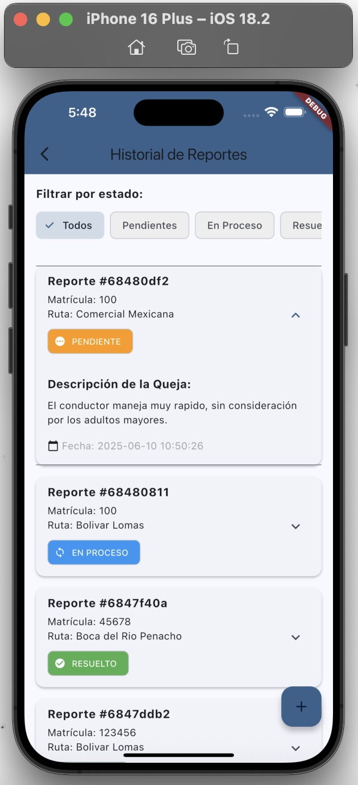

# 🚌 MobiPass - Sistema de Gestión de Pasajes de Autobús

<div align="center">
  
</div>

MobiPass es una aplicación móvil moderna desarrollada en Flutter que permite a los usuarios gestionar sus pasajes de autobús de manera eficiente y segura. La aplicación utiliza MongoDB Atlas como base de datos en la nube para garantizar alta disponibilidad y escalabilidad, junto con un backend robusto en Node.js.

## ✨ Características Principales

- 🔐 Autenticación segura de usuarios, conductores y administradores
- 🎫 Compra y gestión de pasajes digitales
- 🚍 Validación de pasajes por número de bus
- 📱 Interfaz de usuario intuitiva y moderna
- 🔄 Sincronización en tiempo real con base de datos en la nube
- 📊 Sistema de reportes y seguimiento
- 👥 Gestión de usuarios y conductores

## 🛠️ Tecnologías Utilizadas

### Frontend
- Flutter (Dart)
- Material Design 3
- Provider para gestión de estado
- HTTP para comunicación con API

### Backend
- Node.js
- Express.js
- MongoDB Atlas (Base de datos en la nube)
- JWT para autenticación
- Bcrypt para encriptación

## 🚀 Instalación y Configuración

### Requisitos Previos
- Flutter SDK (versión 3.0.0 o superior)
- Node.js (versión 14.0.0 o superior)
- Cuenta en MongoDB Atlas
- Git

### Pasos de Instalación

1. **Clonar el Repositorio**
   ```bash
   git clone https://github.com/tu-usuario/mobipass.git
   cd mobipass
   ```

2. **Configurar MongoDB Atlas**
   - Crear una cuenta en [MongoDB Atlas](https://www.mongodb.com/cloud/atlas)
   - Crear un nuevo cluster (puede ser el tier gratuito)
   - Obtener el string de conexión del cluster (seleccionar driver Node.js versión 6.7 o superior)
   - En el archivo `backend/src/index.js`, reemplazar el string de conexión de MongoDB con el tuyo:
     ```javascript
     mongoose.connect('tu-string-de-conexion-de-mongodb-atlas')
     ```

3. **Configurar el Backend**
   ```bash
   cd backend
   npm install
   ```

4. **Iniciar el Servidor**
   ```bash
   npm run dev
   ```

5. **Configurar el Frontend**
   ```bash
   cd ..
   flutter pub get
   ```

6. **Ejecutar la Aplicación**
   ```bash
   flutter run
   ```

## 📱 Uso de la Aplicación

### Registro e Inicio de Sesión
1. Abre la aplicación
2. Selecciona "Registrarse" para crear una nueva cuenta
3. Completa el formulario con tus datos
4. Para iniciar sesión, usa tu correo y contraseña

<div align="center">
  
  
</div>

### Compra y Uso de Pasajes
1. Inicia sesión en la aplicación
2. Selecciona "Comprar Boletos"
3. Elige la cantidad y tipo de boletos (estudiante/adulto)
4. Confirma la compra
5. Para usar un boleto:
   - Solicita el número de bus al conductor
   - Ingresa el número en la aplicación
   - Muestra la confirmación al conductor

<div align="center">
  
  
</div>

### Visualización de Rutas
1. Accede a la sección "Rutas Disponibles"
2. Selecciona una ruta del menú desplegable
3. Visualiza el recorrido detallado en el mapa
4. Planifica tu viaje de manera eficiente

<div align="center">
  
  
</div>

### Sistema de Reportes
1. Selecciona "Realizar Reporte"
2. Ingresa la matrícula del conductor
3. Describe el problema o situación
4. Envía el reporte
5. Da seguimiento en "Historial de Reportes"

<div align="center">
  
  
</div>

## 👥 Desarrolladores

- **Michell Alexis Policarpio Moran**
- **Isabella Coria Juarez**

## 📞 Soporte

Si encuentras algún problema o tienes alguna sugerencia, por favor:
- Abre un issue en GitHub
- Contacta al equipo de desarrollo
- Consulta la documentación

## 📚 Información Académica

Este proyecto fue desarrollado como parte de la Experiencia Educativa:
- **Materia:** Base de Datos Distribuidas y en la Nube
- **Universidad:** Universidad Veracruzana
- **Facultad:** Ingeniería Eléctrica y Electrónica
- **Docente:** Primavera Lucho Arguelles

---

Desarrollado con ❤️ por el equipo de MobiPass
